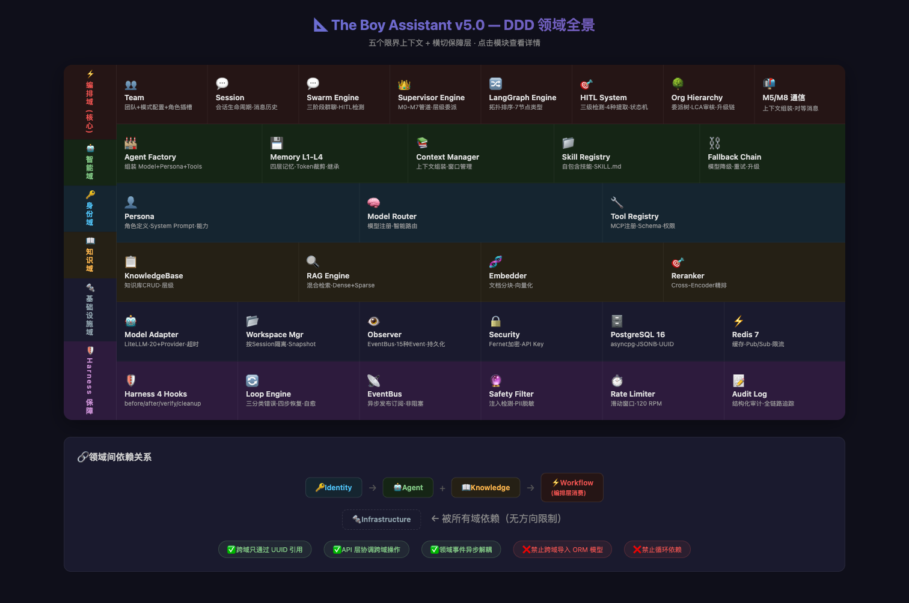
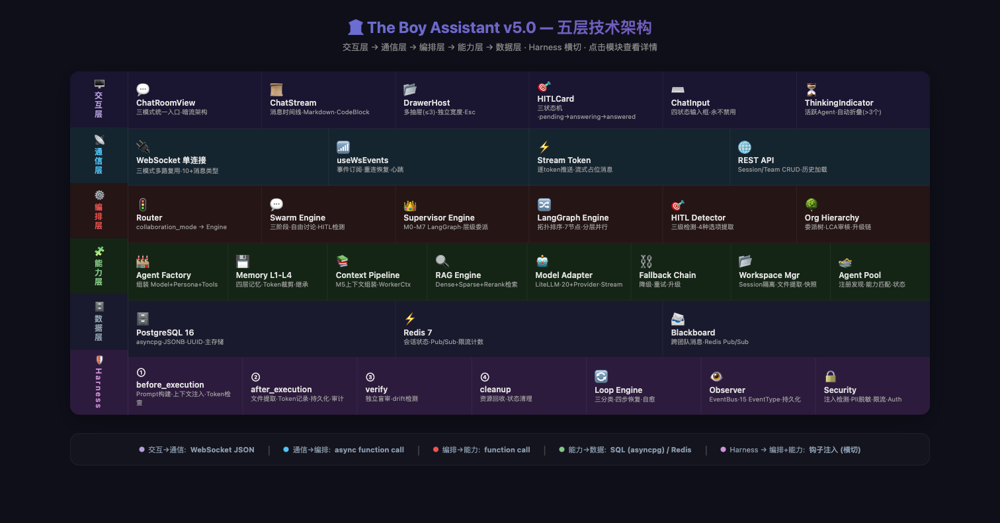
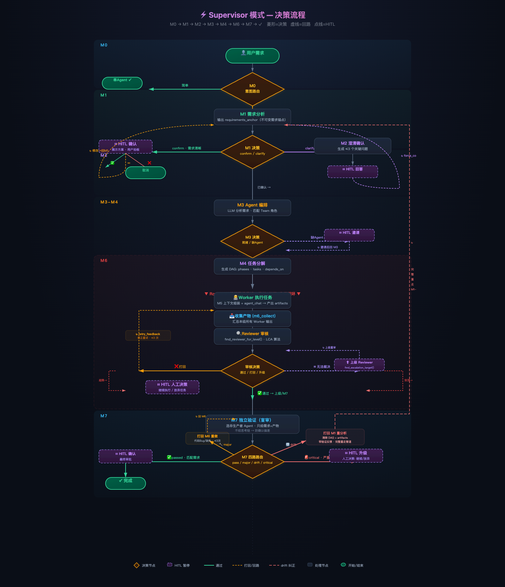
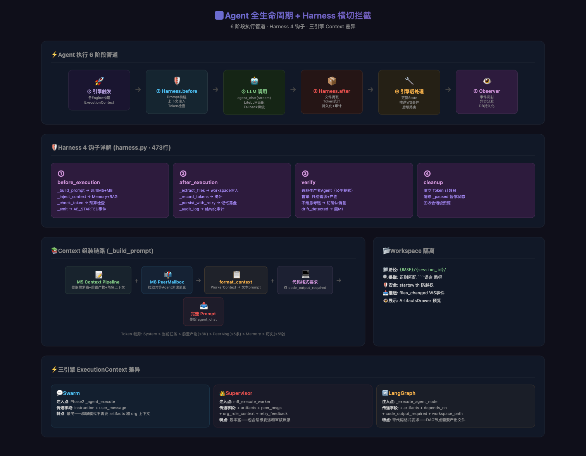
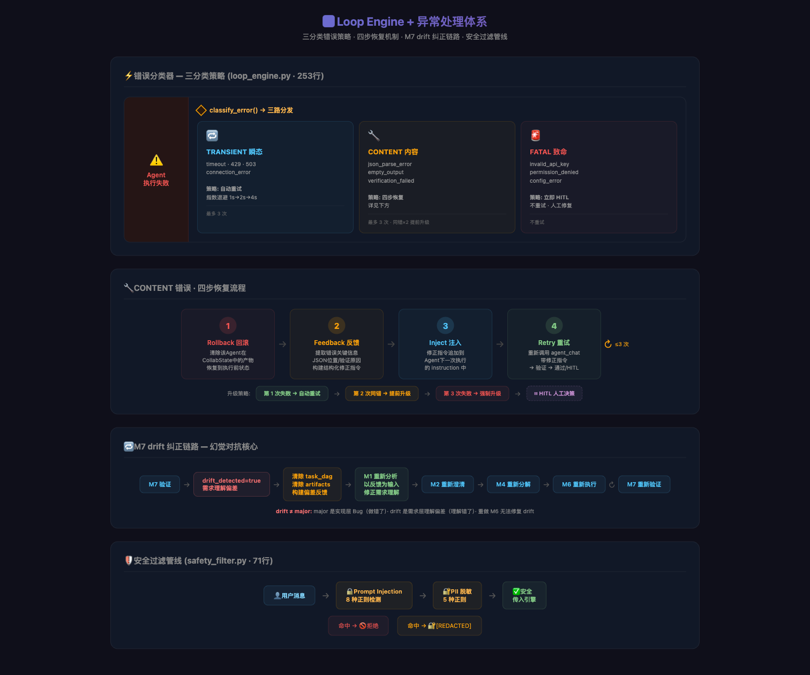
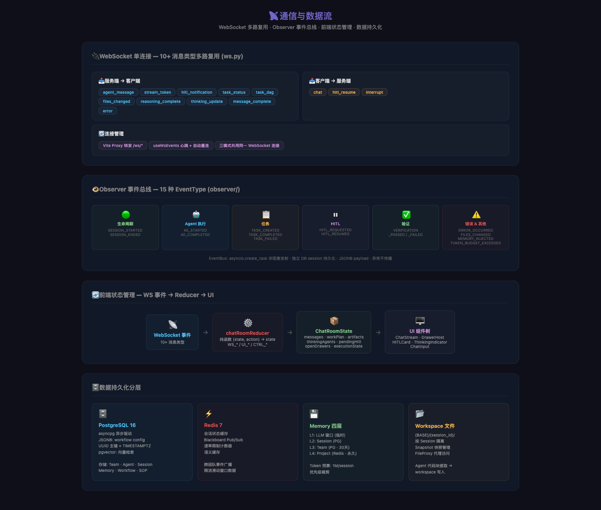
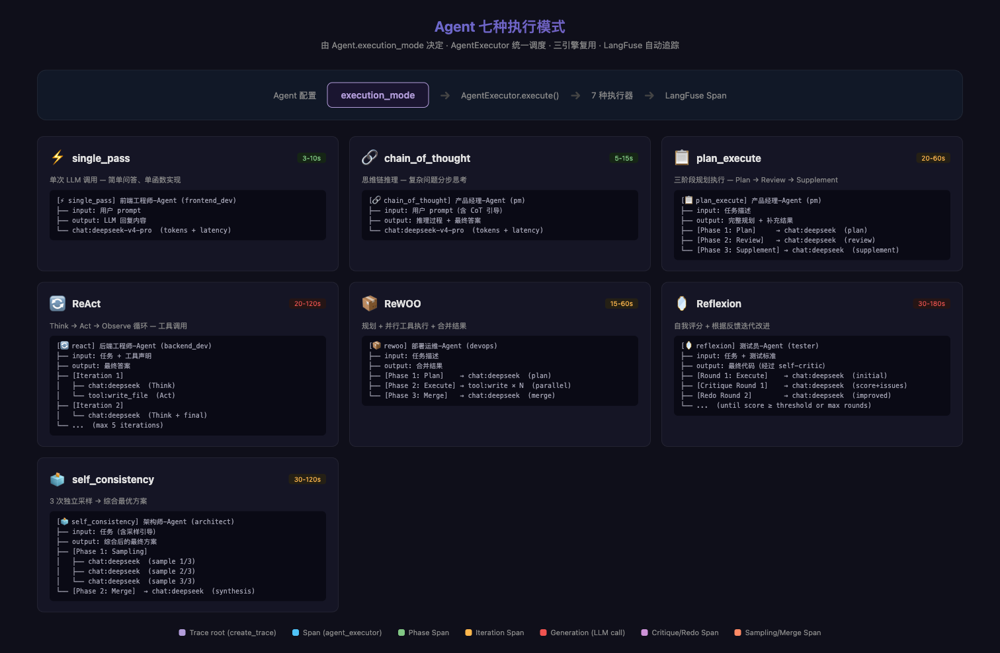
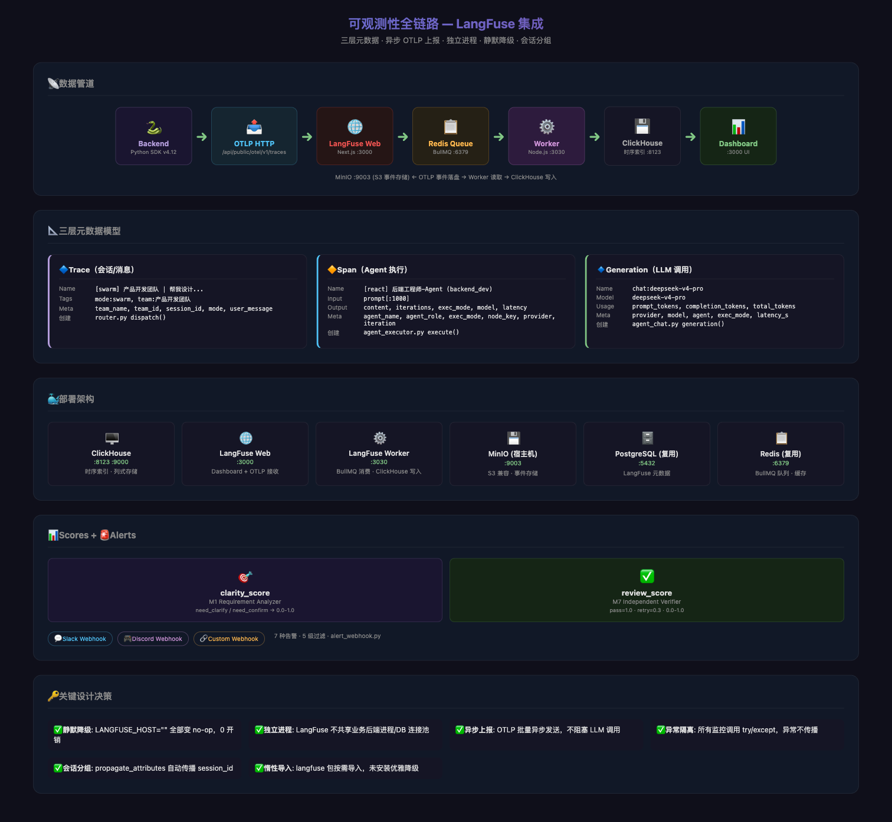

# The Boy Assistant v5.0

> 企业级 AI Multi-Agent 协作平台 — 三模式引擎 · 七种执行模式 · 全链路可观测 · DDD 领域驱动 · Harness 横切保障

[](https://www.python.org/)
[](https://fastapi.tiangolo.com/)
[](https://react.dev/)
[](https://www.postgresql.org/)
[](https://langfuse.com/)
[](LICENSE)

---

## 概述

The Boy Assistant 是一个**企业级 AI Multi-Agent 协作平台**，提供三种协作范式 + 七种 Agent 执行模式 + 全链路可观测性。通过统一聊天室界面和 Harness 横切保障层，为企业研发团队提供从自由讨论到严格 SOP 执行的完整协作工具链。

### 核心能力

| 能力 | 说明 |
|------|------|
| **三模式协作** | Swarm（群聊）/ Supervisor（主管委派）/ LangGraph（DAG 工作流）|
| **七种执行模式** | single_pass · chain_of_thought · plan_execute · react · rewoo · reflexion · self_consistency |
| **全链路可观测** | LangFuse 自部署 — Traces / Spans / Generations 三层追踪 + Scores 评分 + 告警 |
| **HITL 人机协作** | 三级检测 + 状态机卡片 + 永不禁用输入框 |
| **层级委派** | 基于组织树的自动委派、LCA 审核、升级链 |
| **幻觉对抗** | M7 独立盲审 → drift_detected → 回 M1 重新分析需求 |
| **故障自愈** | Loop Engine 三分类错误 + 四步恢复流程 |
| **横切保障** | Harness 拦截器统一 Prompt 构建 / Token 管控 / 文件提取 / 审计 |
| **流式渲染** | 逐 token 推送 + 代码块高亮 + Markdown 实时预览 |

---

## 系统架构

```
┌─────────────────────────────────────────────────────────────┐
│                    L1 交互层 (Frontend)                     │
│  ChatRoomView · ChatStream · DrawerHost · HITLCard · Input  │
├─────────────────────────────────────────────────────────────┤
│                    L2 通信层 (WebSocket + REST)             │
│  单连接多路复用 · 10+ 消息类型 · Vite Proxy · Stream Token  │
├──────┬──────────────┬──────────────┬────────────────────────┤
│Swarm │ Supervisor   │  LangGraph   │  ← L3 编排层 (核心域)  │
│Engine│ Engine       │  Engine      │   三模式协作引擎        │
├──────┴──────────────┴──────────────┴────────────────────────┤
│                    L4 能力层 (Identity + Agent + Knowledge)  │
│  AgentFactory · Memory L1-L4 · 7 Exec Modes · RAG · Pool   │
│  ModelAdapter · FallbackChain · WorkspaceMgr · ContextMgr   │
├─────────────────────────────────────────────────────────────┤
│                    L5 数据层 (Data)                         │
│     PostgreSQL 16 (主存储) · Redis 7 (缓存/消息)             │
├─────────────────────────────────────────────────────────────┤
│                    可观测性 (Observability)                  │
│   LangFuse v3 · Traces/Span/Generations · Scores · Alerts   │
├─────────────────────────────────────────────────────────────┤
│              Harness 横切保障层 (Cross-Cutting)              │
│  before → after → verify → cleanup · Loop Engine · Observer │
└─────────────────────────────────────────────────────────────┘
```

### DDD 领域划分

| 领域 | 职责 | 核心模块 |
|------|------|---------|
| **Identity** 身份域 | 谁·用什么脑·有什么手 | Persona · Model Router · Tool Registry |
| **Agent** 智能域 | 单 Agent 智能闭环 | Agent Factory · Memory L1-L4 · Context Pipeline · Skill · Fallback |
| **Knowledge** 知识域 | 知识存储与检索 | KnowledgeBase · RAG (Dense+Sparse) · Reranker |
| **Workflow** 编排域 (核心) | 多 Agent 协作 | Team · Session · 三引擎 · 7 Exec Modes · HITL · Org Hierarchy |
| **Infrastructure** 基础设施 | 外部系统交互 | LLM Adapter · Workspace · Observer · Security · LangFuse Client |

> 详细架构文档：[docs/system-architecture-v5.md](docs/system-architecture-v5.md)

### 架构图

| # | 图 | 说明 |
|---|-----|------|
| 01 |  | DDD 领域全景 |
| 02 |  | 五层技术架构 |
| 03 |  | Supervisor 决策流程 |
| 04 |  | Agent 生命周期 + Harness |
| 05 |  | Loop Engine + 异常处理 |
| 06 |  | 通信与数据流 |
| 07 |  | **Agent 执行模式** |
| 08 |  | **可观测性全链路** |

---

## 快速开始

### 模块一览

| 模块 | 目录 | 端口 | 说明 |
|------|------|------|------|
| **后端** | `backend/` | 8000 | FastAPI + WebSocket，三引擎 + Agent 执行器 |
| **前端** | `frontend/` | 5173 | React 18 + TypeScript，聊天室 UI |
| **数据库** | Docker | 5432 | PostgreSQL 16 + pgvector |
| **缓存** | Docker | 6379 | Redis 7 |
| **监控 Web** | Docker | 3000 | LangFuse Dashboard + OTLP 接收 |
| **监控 Worker** | Docker | 3030 | LangFuse 队列消费 |
| **监控时序** | Docker | 8123 | ClickHouse 列式存储 |
| **监控存储** | 宿主机 | 9003 | MinIO S3 兼容事件存储 |

### 环境要求

- Python 3.12+ (推荐 miniconda)
- Node.js 20+
- Docker Desktop (for PostgreSQL, Redis, LangFuse)

### 1. 启动基础服务

```bash
cd backend
cp .env.example .env          # 编辑 .env 填入 LLM API Key
docker compose up -d           # PostgreSQL + Redis
```

### 2. 启动后端

```bash
cd backend
pip install -r requirements.txt
uvicorn app.main:app --host 0.0.0.0 --port 8000 --reload
```

### 3. 启动前端

```bash
cd frontend
npm install
npm run dev                    # Vite :5173
```

浏览器打开 `http://localhost:5173`，选择团队 → 开始对话。

### 4. 启动监控（可选）

```bash
# 1. 创建 LangFuse 数据库
docker exec backend-postgres-1 psql -U theboy -d theboy -c "CREATE DATABASE langfuse;"

# 2. 启动 MinIO (S3 存储)
# 下载: https://dl.min.io/server/minio/release/darwin-arm64/minio
chmod +x /tmp/minio
MINIO_ROOT_USER=minioadmin MINIO_ROOT_PASSWORD=minioadmin /tmp/minio server /tmp/minio-data --address :9003 --console-address :9001 &

# 3. 创建 Bucket
# 下载 mc: https://dl.min.io/client/mc/release/darwin-arm64/mc
/tmp/mc alias set local http://localhost:9003 minioadmin minioadmin
/tmp/mc mb local/langfuse

# 4. 启动 LangFuse
docker compose -f docker-compose.langfuse.yml up -d

# 5. 配置后端 .env
echo "LANGFUSE_HOST=http://localhost:3000" >> backend/.env
echo "LANGFUSE_PUBLIC_KEY=pk-lf-..." >> backend/.env   # 从 localhost:3000 注册获取
echo "LANGFUSE_SECRET_KEY=sk-lf-..." >> backend/.env   # 从 localhost:3000 注册获取

# 6. 重启后端 → Dashboard 查看 Traces/Sessions
```

> 详细说明：[docs/monitoring-observability-module.md](docs/monitoring-observability-module.md)

---

## 三模式引擎

### Swarm（群聊模式）
多 Agent 自由讨论，流程**涌现**。三阶段：RoundTable（≤3轮）→ Agent 执行（Harness 注入）→ HITL/完成。

### Supervisor（主管模式）
M0-M7 LangGraph 固定管道，组织层级委派。M7 四路路由：passed→HITL / major→M6 / **drift→M1** / critical→HITL。

### LangGraph（工作流模式）
用户自定义 DAG，拓扑排序分层并行。7 种节点类型。

---

## 七种 Agent 执行模式

| 模式 | 适用场景 | Span 结构 |
|------|---------|----------|
| ⚡ **single_pass** | 简单问答 | 1 span → 1 generation |
| 🔗 **chain_of_thought** | 复杂推理 | 1 span → 1 generation |
| 📋 **plan_execute** | 分阶段规划 | 1 span → 3 phase spans → 3 generations |
| 🔄 **react** | 工具调用 | 1 span → N iter spans → 1-2N generations |
| 📦 **rewoo** | 并行工具执行 | 1 span → 3 phase spans → N generations |
| 🪞 **reflexion** | 自我纠错 | 1 span → critique/redo → 2R-1 generations |
| 🗳️ **self_consistency** | 多方案对比 | 1 span → 3 samples + merge → 4 generations |

> 详细文档：[docs/agent-execution-modes.md](docs/agent-execution-modes.md)

---

## 可观测性

```
Backend (SDK v4) → OTLP → LangFuse Web → Redis Queue → Worker → ClickHouse
                              ↓
                         MinIO (S3)
```

- **Traces**：按 session_id 分组，Sessions 页面看完整对话
- **Spans**：每个 Agent 的输入/输出/执行模式/延迟
- **Generations**：每次 LLM 调用的模型/token/延迟
- **Scores**：clarity_score (M1) + review_score (M7)
- **Alerts**：Slack/Discord/Custom Webhook，7 种告警 + 5 级过滤

> 详细文档：[docs/monitoring-observability-module.md](docs/monitoring-observability-module.md)

---

## 技术栈

| 层 | 技术 | 说明 |
|----|------|------|
| 编排引擎 | LangGraph StateGraph | checkpoint、条件路由、状态持久化 |
| LLM 适配 | LiteLLM | 20+ Provider 统一接口 |
| 后端 | FastAPI + WebSocket | 异步原生支持 |
| 数据库 | PostgreSQL 16 (asyncpg) | JSONB · UUID · pgvector |
| 缓存 | Redis 7 | 会话状态 · BullMQ · 限流 |
| 可观测 | LangFuse v3 + MinIO + ClickHouse | 自部署全链路追踪 |
| 前端 | React 18 + TypeScript | useReducer 状态管理 |
| 构建 | Vite | HMR + WebSocket Proxy |

---

## 关键设计决策 (ADR)

| ADR | 决策 | 理由 |
|-----|------|------|
| ADR-001 | 三引擎独立·共享能力层 | 三种范式核心约束不同，统一会牺牲灵活性 |
| ADR-002 | 聊天室为唯一入口 | 统一心智模型，模式差异在暗流抽屉 |
| ADR-003 | Harness 横切 vs 分散实现 | 三引擎 80% 重复逻辑，横切降维护成本 |
| ADR-004 | HITL 输入框永不禁用 | LLM 选项不可靠·用户需降级路径 |
| ADR-005 | CollabState 单一状态树 | LangGraph 内建 checkpoint · 可追踪回滚 |
| ADR-006 | WebSocket 单连接 | 避免多连接时序问题 |
| ADR-007 | 执行模式由 Agent 决定 | 编排层不干预思考策略，Agent 自治 |

---

## 项目结构

```
the-boy-assistant/
├── README.md
├── docker-compose.langfuse.yml            # LangFuse 监控部署
│
├── backend/
│   ├── .env.example
│   ├── docker-compose.yml                 # PostgreSQL + Redis
│   ├── requirements.txt
│   ├── CLAUDE.md
│   │
│   ├── app/
│   │   ├── main.py
│   │   ├── core/                          # 配置 · 数据库 · 安全 · 限流
│   │   ├── adapters/llm/                  # LiteLLM 适配层
│   │   ├── models/                        # ORM 模型 (22 文件)
│   │   ├── schemas/                       # Pydantic schemas (16 文件)
│   │   ├── api/v1/                        # REST + WebSocket 端点 (20+)
│   │   ├── services/
│   │   │   ├── collaboration/             # ⚡ 编排域 (核心)
│   │   │   │   ├── router.py              # 模式分发
│   │   │   │   ├── agent_executor.py      # 7 种执行模式调度
│   │   │   │   ├── graph.py               # M0-M8 LangGraph 状态图
│   │   │   │   ├── engines/               # Swarm · Supervisor · LangGraph
│   │   │   │   ├── m0..m8_*.py            # M0-M8 管道节点 (17 文件)
│   │   │   │   └── *executor.py           # 7 种执行器 (plan/react/rewoo/...)
│   │   │   ├── trace_context.py           # 📊 Trace 上下文传播
│   │   │   ├── langfuse_client.py         # 📊 LangFuse SDK 适配
│   │   │   ├── alert_webhook.py           # 🚨 告警通道 (Slack/Discord)
│   │   │   ├── harness.py                 # 🛡️ Harness 横切
│   │   │   ├── loop_engine.py             # 🔄 错误恢复
│   │   │   ├── safety_filter.py           # 🔒 安全过滤
│   │   │   ├── observer/                  # 事件总线
│   │   │   ├── rag/                       # 知识检索
│   │   │   └── workspace/                 # 文件隔离
│   │   └── tools/                         # 工具执行引擎
│   └── migrations/                        # Alembic (22 版本)
│
├── frontend/
│   └── src/
│       └── features/
│           ├── chatroom/                   # 💬 聊天室 (核心)
│           ├── resources/                  # Agent/Persona/Skill 管理
│           ├── teams/                      # 团队管理
│           ├── sop-designer/               # SOP 设计器
│           └── workflows/                  # 工作流管理
│
└── docs/
    ├── system-architecture-v5.md          # 完整架构文档 (13 章)
    ├── agent-execution-modes.md           # 执行模式设计文档
    ├── monitoring-observability-module.md # 可观测性设计文档
    ├── images/                            # 8 张架构图 PNG
    └── 架构图-v5-wip/                     # 架构图 HTML 源文件
```

---

## License

MIT

---

*Built with ❤️ by The Boy Assistant Team | v5.0 — 2026-07*
