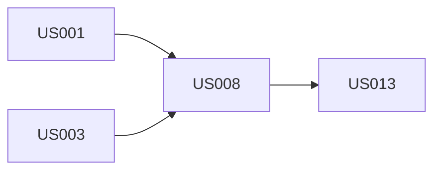

# 用户故事地图: {产品名称}

## 用户角色
- {角色A}: {描述}
- {角色B}: {描述}

## 故事地图

### 用户活动 (Activities)

| 活动 | 任务 | Story (MVP) | Story (V1) | Story (V2) |
|------|------|-------------|------------|------------|
| **注册登录** | 手机注册 | US-001 短信验证码注册 | | |
| | 社交登录 | | US-005 微信登录 | US-010 Apple登录 |
| | 密码找回 | US-002 重置密码 | | |
| **内容浏览** | 首页推荐 | US-003 简单推荐列表 | US-006 个性化推荐 | |
| | 搜索 | | US-007 关键词搜索 | US-011 高级筛选 |
| | 分类浏览 | US-004 分类列表 | | US-012 标签系统 |
| **订单管理** | 创建订单 | US-008 提交订单 | US-009 购物车 | |
| | 支付 | US-013 微信/支付宝 | | US-014 分期付款 |

## MVP 切片 (Walking Skeleton)

> 横向切取最基础的用户旅程，确保端到端可运行

| Story | 描述 | 故事点 |
|-------|------|--------|
| US-001 | 短信验证码注册 | 3 |
| US-002 | 重置密码 | 2 |
| US-003 | 简单推荐列表 | 5 |
| US-004 | 分类列表 | 3 |
| US-008 | 提交订单 | 8 |
| US-013 | 微信/支付宝支付 | 5 |
| **合计** | | **26** |

## 依赖关系

